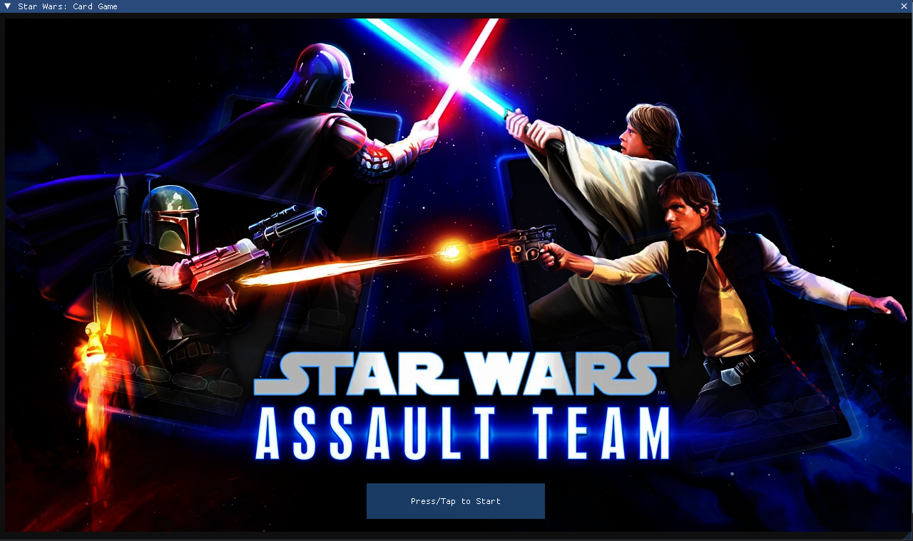
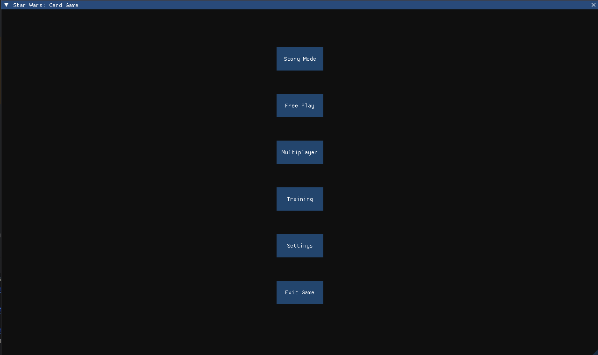

# Star Wars Collections
A remake of the classic Star Wars: Assault Team game which was discontinued. 
-- - 
This project is not only a tribute to the beloved game, but also a project for 
    the youngest member of Miller Inc to learn and practice coding skills. And the
    final goal is to make an open source version of the game available to the public,
    while also providing a fun and educational programming experience for anyone interested. 
-- -
## Features
- Collect and upgrade characters from the Star Wars universe.
- Engage in strategic battles using your favorite characters.
- Explore various game modes and challenges.
- Local-Networked multiplayer battles.

-- - 

## Dependencies (for building)
- CMake
- SDL3 (included)
- SDL3 Net (included)
- imgui (included)
- Vulkan SDK
- Nlohamann JSON (included)
- stb_image (included)

## Dependencies (for running)
- Vulkan capable GPU and drivers (see bottom of README for more details)

## Building
1. Clone the repository:
    ```bash
    git clone git@github.com:Miller-Inc/Star-Wars-Collections.git --recurse-submodules
    ```
2. Create a build directory and navigate into it:
    ```bash
   mkdir build && cd build
   ```
3. Run CMake to configure the project:
    ```bash
    cmake ..
    ```
4. Build the project using your preferred build system (e.g., Make, Ninja, etc
    ```bash
    cmake --build .
    ```
5. Run the game:
    ```bash
    ./StarWarsCollections
    ```
## Learning Resources
For those interested in using this project as a learning tool, 
contact me at jwmiller006@outlook.com and I can provide additional resources
and guidance on how to get started with game development and programming. 
Please provide some information about your current skill level 
and what you hope to achieve.

### Vulkan Installation Instructions
-- -
I am aware that as this project is meant for learning, some developers may not have
    had experience with Vulkan. Here are some resources to help you get started:
- [Vulkan Official Website](https://www.khronos.org/vulkan/)
- [Vulkan Tutorial](https://vulkan-tutorial.com/)
- [Vulkan SDK Download](https://vulkan.lunarg.com/sdk/home)

#### SDK Installation
##### Windows
1. Download the Vulkan SDK from the [LunarG website](https://vulkan.lunarg.com/sdk/home).
2. Run the installer and follow the on-screen instructions.
3. Set the `VULKAN_SDK` environment variable to point to the SDK installation directory.
4. Add the `bin` directory of the SDK to your system's `PATH` environment variable.
5. Restart your computer to apply the changes.

##### Linux (Ubuntu)
1. Install Prerequisites:
    ```bash
    sudo apt-get update
    sudo apt install xz-utils
    sudo apt-get install libglm-dev cmake libxcb-dri3-0 libxcb-present0 libpciaccess0 \
    libpng-dev libxcb-keysyms1-dev libxcb-dri3-dev libx11-dev g++ gcc \
    libwayland-dev libxrandr-dev libxcb-randr0-dev libxcb-ewmh-dev \
    git python-is-python3 bison libx11-xcb-dev liblz4-dev libzstd-dev \
    ocaml-core ninja-build pkg-config libxml2-dev wayland-protocols python3-jsonschema \
    clang-format qtbase5-dev qt6-base-dev
    ```
2. Install Vulkan SDK: 
    ``` bash
    sudo apt install vulkan-utils vulkan-validationlayers libvulkan-dev -y
    ```
3. Verify Installation:
    ```bash
    # Check Vulkan installation (Option 1)
    vulkaninfo | less
    # Check Vulkan installation (Option 2)
    vkcube
    ```

## Contributing
Contributions are welcome! If you have suggestions for improvements 
or new features, feel free to open an issue or submit a pull request. 
Please try to adhere to the structure that is already in place 
within the project. 

## Screen Shots
-- -
Opening Screen

-- -
Game Mode Selection Screen
